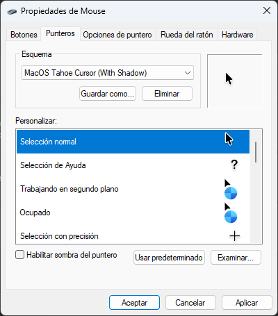
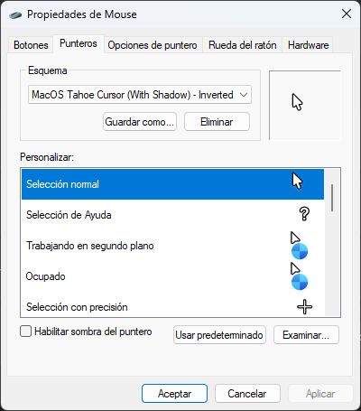

# Cursor Scheme Inverter

[](https://opensource.org/licenses/MIT)
[](https://learn.microsoft.com/en-us/dotnet/csharp/)
[](https://dotnet.microsoft.com/download/dotnet/9.0)
[](https://ko-fi.com/darklinkpower)

A command-line and drag-and-drop utility that converts Windows cursor schemes by inverting their grayscale colors (black to white, dark gray to light gray, and vice versa).

It allows changing dark cursor themes into light variants, or light variants into dark ones, without manual image editing.

**[Download here](https://github.com/darklinkpower/CursorSchemeInverter/releases/latest)**

---

## Features

* **Grayscale Inversion:** Inverts black, white, and gray shades. Colored pixels, alpha channels, and transparency are not modified.
* **Supported file types:**
  * `.CUR`: Static cursors. Keeps all icons layers intact.
  * `.ANI`: Animated cursors. Processes all individual image frames within the file.
  * `.INF`: Setup files. Rewrites files names, paths, and the scheme name so the new theme can be installed.

Converted files get `_Inverted` added to their filenames. The final Windows scheme name is updated with ` - Inverted`. The original cursor files are left completely untouched.

---


## Visual Comparison

| Before | After |
| :---: | :---: |
|  |  |

---

## Usage

The application can be executed in three ways:

### 1. Automatic Execution (Double-Click)
Placing the executable in a folder containing cursor assets or an `.inf` file and running it will process all compatible files in that directory. Converted assets are placed in a newly created `\Converted` subfolder.

### 2. Drag and Drop
Files or folders can be dragged from Windows Explorer and dropped directly onto `CursorSchemeInverter.exe` to process them.

### 3. Command Line Interface (CLI)
The utility can be executed via terminal using the following syntax and arguments:

```text
Syntax:
    CursorSchemeInverter.exe [targets...] [-o <output_directory>] [-h]

Arguments & Switches:
    [targets...]        Optional list of file paths (.cur/.ani) or folders.
                        If blank, defaults to the current working directory.
    -o, --output <dir>  Redirects output to a custom folder path.
                        Defaults to creating a '\Converted' subfolder.
    -h, --help          Displays this terminal help dialogue.
```

CLI Examples:
```bash
# Convert a target directory path
CursorSchemeInverter.exe C:\Some\Path\To\MyCursorFilesDirectory

# Process explicit assets and route them to a specific storage partition
CursorSchemeInverter.exe pointer.cur spinner.ani -o D:\OutputFolder
```
